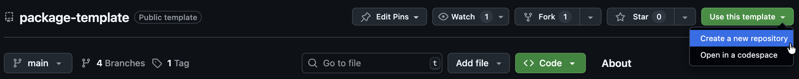
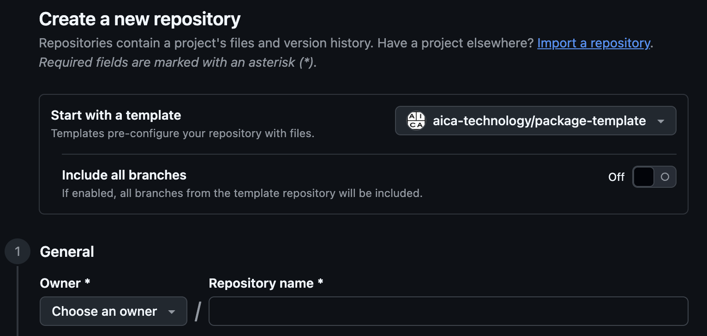

[](https://vscode.dev/redirect?url=vscode://ms-vscode-remote.remote-containers/cloneInVolume?url=https://github.com/aica-technology/component-template)

# AICA Package Template

A software development kit for creating custom component and controller extensions for AICA applications.

Custom extensions are built and distributed in ROS 2 compatible packages with additional metadata for
the AICA System. When an AICA package contains multiple ROS 2 packages, it is referred to as a _collection_.

Full documentation for creating, testing and packaging custom components is available at
https://docs.aica.tech/docs/category/custom-components. A page for creating custom controllers is coming soon.

[Docker](https://docs.docker.com/get-docker/) is required to initialize, develop and build your package.

## Create a custom package template repository

To create a package template, create a new repository in GitHub using this repository as a template.

 

Alternatively, you can also clone this repository locally and create a new repository from it.

```bash
git clone git@github.com:aica-technology/package-template.git my_package
```

## Running the package template wizard

When you first clone the template repository, no source will be populated. First, start the initialization wizard by
executing `./initialize_templates.sh`. An interactive console UI will guide you through the necessary steps to populate
the directory. During this process, you may opt in/out to specific templates or types of components to generate.

In case you already ran the wizard, but are not happy with your selection, you may re-run it as if it was the first run.
**This will remove any files previously created through the wizard!**

If you select more than one packages during the wizard run, the wizard will generate a _collection_ of packages. You
will be asked for a collection name and the changes will be reflected in your `aica-package.toml`.

If you want to include even more ROS packages within your collection, create a new package folder under `source` and add
it to your `aica-package.toml` file under `[build.packages.name_of_new_package]` accordingly.

## Configure the development environment

This template uses a devContainer configuration ([`devcontainer.json`](./.devcontainer/devcontainer.json)) with base
AICA Docker images for a seamless integrated development experience.

After running the wizard that initializes all configurations, use VSCode and the `Dev Containers` extension by simply
opening your repository in VSCode. Then, you will be prompted to "Reopen in Container". You may also manually
"Reopen in Container" through VSCode's command palette.

Other IDEs such as JetBrains can similarly be configured to use development containers.

If any changes are made to aica-package.toml (including any package names or dependencies), remember to rebuild the
devcontainer.

If you choose to have multiple packages generated from the template, the wizard will ask you which collection package
should be used for the devContainer configuration. You can always manually change this by editing the
`devcontainer.json`.

## Building your templates

You can build your collection or single package using the following command:

```bash
docker build -f aica-package.toml .
```

We use a custom Docker frontend instead of a Dockerfile, so all configuration of the build is stored in
`aica-package.toml`. As we are using `docker build` to build you can pass any Docker argument, like `-t <image_name>` to
tag the image or `--platform <platform>` to build for a specific platform.

## Testing your collection or package

You can invoke any unit tests in your package by changing the docker build stage to `test`, e.g.:

```bash
docker build -f aica-package.toml --target test .
```

## Collection and package configuration with `aica-package.toml`

All build configurations, metadata and dependencies are defined in [aica-package.toml](./aica-package.toml). Refer to
the [docs](https://docs.aica.tech/docs/reference/custom-components/aica-package-toml) for more details about the syntax.

### CLI configuration

The `aica-package.toml` file contains the configuration of the build process but you can override it using the CLI.

In order to do so, you will need to pass `--build-arg config.<key>=<value>` to the `docker build` command.

Example:

```bash
docker build -f aica-package.toml --build-arg config.build.cmake_args.SOME_FLAG=Release .
```

### Installing external dependencies

As the build is done in a Docker container, you will need to install external dependencies through `aica-package.toml`.

#### System libraries

You can add system libraries by adding the list of packages to install through `apt`:

```toml
[build.packages.component.dependencies.apt]
libyaml-cpp-dev = "*"
```

Note that the `*` is currently ignored but might be used in the future to specify a version.

#### Python packages

`aica-package.toml` will automatically install any Python packages specified in a `requirements.txt` file stored in your
component package folder. However, you can change the name of that file or specify the packages to install directly in
`aica-package.toml`:

```toml
[build.packages.component.dependencies.pip]
file = "requirements.txt"
# OR
[build.packages.component.dependencies.pip.packages]
numpy = "1.0.0"
```

## Using your collection or package

After you have built and tagged your collection or single package as a docker image, you can use it in your application.
See the
[AICA documentation](https://docs.aica.tech/docs/getting-started/installation-and-launch#configuring-the-aica-system-image)
for more details.
